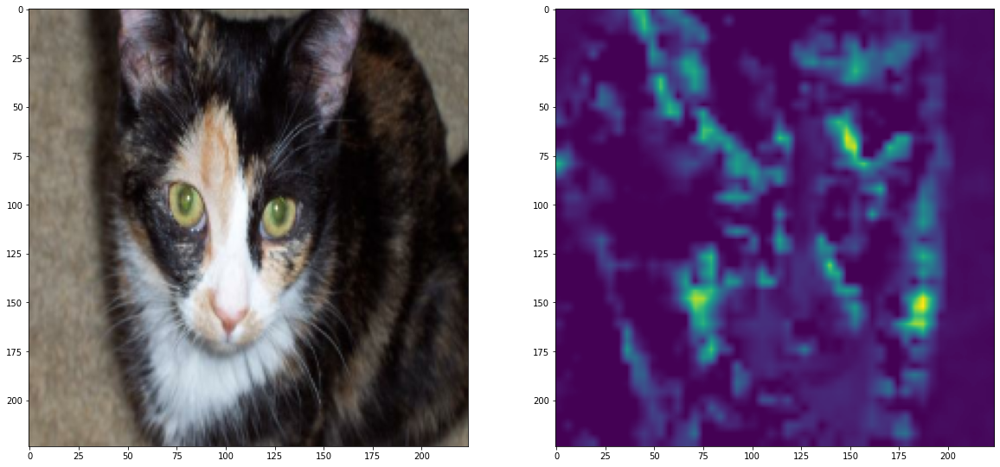
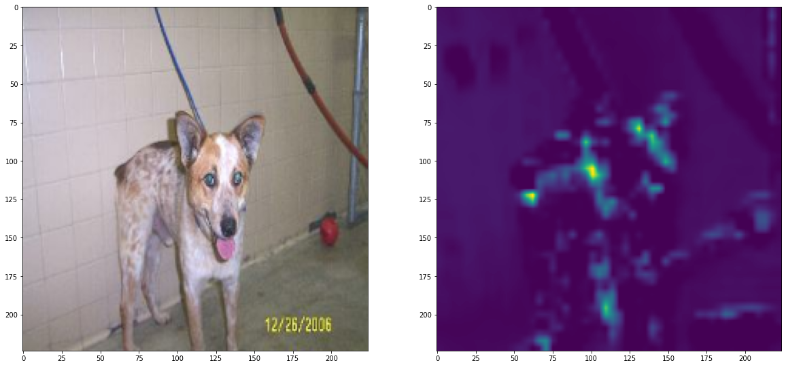

In this repository, I implemented a very naive CNN model and used some metric learning losses to improve the baseline results. In special, I employed the following methods: (1) simple classification loss using cross-entropy (CLS), (2) Center Loss (CL), (3) Triplet Loss, (4) Margin Sample Mining Loss, (5) Quadruplet and (6) Triplet Focal.

The obtained experimental results are presented in Table I. From these, we notice that it is possible to boost the performance of this simple CNN model by justing providing more guidance using different losses.

Table I. Obtained experimental results in the Cats vs Dogs database.
| Approach                 | Acc.  |
|--------------------------|-------|
| CLS                      | 83.58 |
| CLS + CL                 | 87.17 |
| CLS + CL + Triplet       | 89.19 |
| CLS + CL + MSML          | 89.70 |
| CLS + CL + Quadruplet    | 89.36 |
| CLS + CL + Triplet Focal | 88.84 |


In each folder (ex. exp_cls), I provide the configuration (config.json) employed to achieve these results. To train a model using a specific configuration:

```python
# create a novel environment and then
pip install -r requeriments.txt
train.py exp_cls\config.json
```

After the training, the model outputs a gradCAM figure and the result.json file with the final accuracy.





To execute a pretrained model:

```python
predict.py exp_cls\config.json
```

Disclaimer: I did not play too much with these hyperparameters, therefore one can achieve better results just fine-tunning them.


References:

[Triplet Focal: Deep Anomaly Detection for Generalized Face Anti-Spoofing](https://www.google.com/url?sa=t&rct=j&q=&esrc=s&source=web&cd=&ved=2ahUKEwjYu7bK7uH0AhU1rZUCHW9MABsQFnoECAUQAQ&url=https%3A%2F%2Fopenaccess.thecvf.com%2Fcontent_CVPRW_2019%2Fpapers%2FCFS%2FPerez-Cabo_Deep_Anomaly_Detection_for_Generalized_Face_Anti-Spoofing_CVPRW_2019_paper.pdf&usg=AOvVaw2Tqffqrju876pjR4peeir2)

[Quadruplet: Beyond triplet loss: a deep quadruplet network for person re-identification](https://arxiv.org/abs/1704.01719)

[Triplet](https://omoindrot.github.io/triplet-loss)

[Center Loss: A Discriminative Feature Learning Approach for Deep Face Recognition](https://ydwen.github.io/papers/WenECCV16.pdf) 

